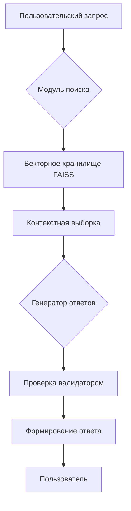
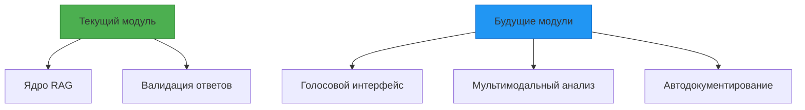

# 🚒 RAG-система для ассистента МЧС

**Умная система обработки документов и генерации ответов с валидацией по нормативам МЧС России**

[](https://www.python.org/)

## 🌟 Основные возможности

- **Интеллектуальный поиск** по техническим документам МЧС с использованием FAISS
- **Автоматическая валидация** ответов на соответствие 6 ключевым критериям безопасности
- **Динамическое обновление** базы знаний при изменении документов
- **Контекстно-зависимые промпты** с адаптацией под специфику запроса
- **Пакетная обработка** запросов с формированием отчетов
- **Интеграция с Mistral API** для генерации ответов экспертного уровня

## 🖥  Интерфейс

)
*Пример работы в интерактивном режиме*

## 🧠 Архитектура системы



## 🛠 Установка

### 📦 Базовые требования
- Python 3.11+ (`pyenv`/`conda` рекомендуются)
- 2 ГБ свободной памяти
- Доступ к Mistral API

### 🖥 Пошаговая установка

```bash
# 1. Клонируйте репозиторий
git clone https://github.com/yourusername/mchs-ai-assistant.git
cd mchs-ai-assistant

# 2. Создайте и активируйте виртуальное окружение
python -m venv .venv
source .venv/bin/activate  # Linux/MacOS
# ИЛИ
.venv\Scripts\activate    # Windows

# 3. Установите зависимости
pip install -r requirements.txt

# 4. Настройте окружение
cp .env.example .env
nano .env  # Добавьте ваш API-ключ Mistral
```

## 🧩 Архитектурная схема



## 🚦 Текущий статус

+ Реализовано (v1.0):
- Векторный поиск документов
- Контекстная генерация ответов
- 6-уровневая валидация
- CLI-интерфейс

! В разработке:
- Интеграция с CAD-системами
- 3D-визуализация сценариев ЧС
- Мобильный интерфейс

# Планируется:
* Система предиктивной аналитики
* Интеграция с IoT датчиками
* AR-режим для тренировок
